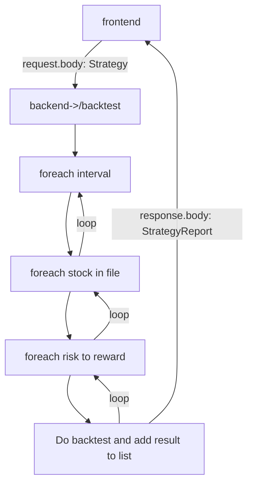

### Installation

4. Enter your API in `config.js`
   ```js
   const API_KEY = "ENTER YOUR API"
   ```

`git push origin feature/AmazingFeature`

<br>
<h2>Front->back->front process:</h2>



<br><br>

<b>ValueExtractionRule:</b>

```
1. Tells how to extract value from attribute on slice relative to given slice
2. Tells how to calculate value made from 2 attributes on 2 different slices using percentage
```

<b>ConditionalRule:</b>

```
1. Tells if attribute value is SAME/BIGGER/SMALLLER then other attribute value
```
