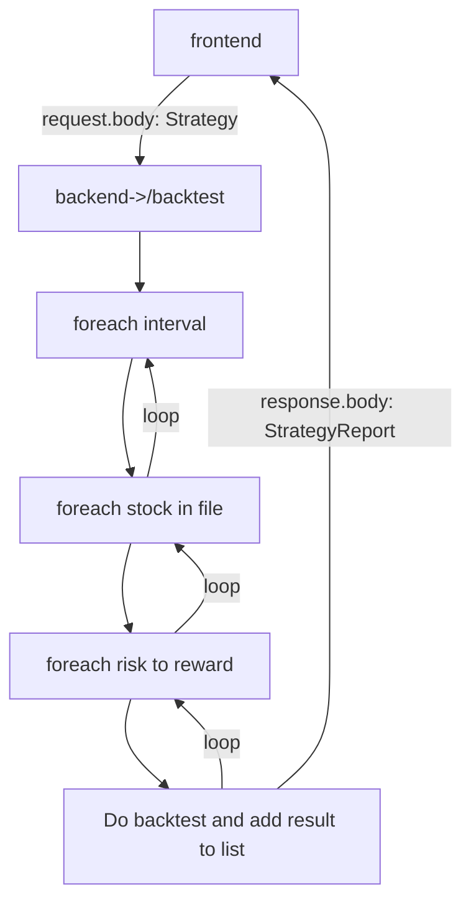

<b>How to use:</b>

1. Check if API keys in `api-key-manager.ts`
2. Call `/update-stock-data` to fetch all stock data which will be saved in `\resources` folder
3. Call `/backtest` with rules in `request` to run backtesting for every fetched stock and timeframe

### Installation

4. Enter your API in `config.js`
   ```js
   const API_KEY = "ENTER YOUR API"
   ```

`git push origin feature/AmazingFeature`

<br>
<h2>Front->back->front process:</h2>



<br><br>

<b>ValueExtractionRule:</b>

```
1. Tells how to extract value from attribute on slice relative to given slice
2. Tells how to calculate value made from 2 attributes on 2 different slices using percentage
```

<b>ConditionalRule:</b>

```
1. Tells if attribute value is SAME/BIGGER/SMALLLER then other attribute value
```

<br><br>

# /update-stock-data

`POST`

<br><br>

# /save-strategy

`POST`

<b>Request:</b>

```json
{
  "name": "2 bar play",
  "enterValueExRule": {
    "id": 1,
    "period": null,
    "attribute1": "CLOSE"
  },
  "stopLossValueExRule": {
    "id": 0,
    "period": null,
    "attribute1": "OPEN",
    "attribute2": "CLOSE",
    "percent": 50
  },
  "strategyConRules": [
    {
      "valueExtractionRule1": {
        "id": 0,
        "period": null,
        "attribute1": "CLOSE"
      },
      "position": "ABOVE",
      "valueExtractionRule2": {
        "id": 1,
        "period": null,
        "attribute1": "CLOSE"
      }
    },
    {
      "valueExtractionRule1": {
        "id": 0,
        "period": null,
        "attribute1": "CLOSE"
      },
      "position": "ABOVE",
      "valueExtractionRule2": {
        "id": 1,
        "period": null,
        "attribute1": "OPEN"
      }
    },
    {
      "valueExtractionRule1": {
        "id": 1,
        "period": null,
        "attribute1": "CLOSE"
      },
      "position": "ABOVE",
      "valueExtractionRule2": {
        "id": 0,
        "period": null,
        "attribute1": "OPEN",
        "attribute2": "CLOSE",
        "percent": 50
      }
    }
  ],
  "riskToRewardList": [1, 2]
}
```

<b>Response:</b>

```json
true
```

<br><br>

# /get-strategies

`GET`

<b>Response:</b>

```json
[
  {
    "name": "2 bar play",
    "enterValueExRule": {
      "id": 1,
      "attribute1": "CLOSE",
      "period": null
    },
    "stopLossValueExRule": {
      "id": 0,
      "attribute1": "OPEN",
      "attribute2": "CLOSE",
      "percent": 50,
      "period": null
    },
    "riskToRewardList": [1, 2],
    "strategyConRules": [
      {
        "valueExtractionRule1": {
          "id": 0,
          "attribute1": "CLOSE",
          "period": null
        },
        "position": "ABOVE",
        "valueExtractionRule2": {
          "id": 1,
          "attribute1": "CLOSE",
          "period": null
        }
      },
      {
        "valueExtractionRule1": {
          "id": 0,
          "attribute1": "CLOSE",
          "period": null
        },
        "position": "ABOVE",
        "valueExtractionRule2": {
          "id": 1,
          "attribute1": "OPEN",
          "period": null
        }
      },
      {
        "valueExtractionRule1": {
          "id": 1,
          "attribute1": "CLOSE",
          "period": null
        },
        "position": "ABOVE",
        "valueExtractionRule2": {
          "id": 0,
          "attribute1": "OPEN",
          "attribute2": "CLOSE",
          "percent": 50,
          "period": null
        }
      }
    ]
  }
]
```

<br><br>

# /get-strategy-reports

`GET`

<b>Response:</b>

```json
[
  {
    "backtestResults": [
      {
        "timesProfited": 59,
        "timesLost": 137,
        "timesIndecisive": 37,
        "winRate": 0.3010204081632653,
        "plRatio": 0.4306569343065693,
        "plFactor": 0.3010204081632653,
        "stockName": "AACG",
        "interval": "15min",
        "rewardToRisk": 1,
        "tradeDateAndValues": [
          {
            "tradeResult": 1,
            "enterDate": "2021-02-26T11:15:00.000Z",
            "enterValue": 5.375,
            "stopLossHitDate": "2021-02-26T11:30:00.000Z",
            "stopLossValue": 5.300000000000001,
            "profitHitDate": null,
            "profitValue": 5.449999999999999
          },
          {
            "tradeResult": 1,
            "enterDate": "2021-02-26T14:15:00.000Z",
            "enterValue": 5.2614,
            "stopLossHitDate": "2021-02-26T14:30:00.000Z",
            "stopLossValue": 5.2318999999999996,
            "profitHitDate": null,
            "profitValue": 5.290900000000001
          }
        ]
      },
      {
        "timesProfited": 50,
        "timesLost": 156,
        "timesIndecisive": 27,
        "winRate": 0.24271844660194175,
        "plRatio": 0.6410256410256411,
        "plFactor": 0.39062500000000006,
        "stockName": "AACG",
        "interval": "15min",
        "rewardToRisk": 2,
        "tradeDateAndValues": [
          {
            "tradeResult": 1,
            "enterDate": "2021-02-26T11:15:00.000Z",
            "enterValue": 5.375,
            "stopLossHitDate": "2021-02-26T11:30:00.000Z",
            "stopLossValue": 5.300000000000001,
            "profitHitDate": null,
            "profitValue": 5.449999999999999
          },
          {
            "tradeResult": 1,
            "enterDate": "2021-02-26T14:15:00.000Z",
            "enterValue": 5.2614,
            "stopLossHitDate": "2021-02-26T14:30:00.000Z",
            "stopLossValue": 5.2318999999999996,
            "profitHitDate": null,
            "profitValue": 5.290900000000001
          }
        ]
      }
    ],
    "strategyName": "2 bar play"
  }
]
```

<br><br>

# /update-strategy-reports

`POST`

<b>Request:</b>

```json
{
  "strategyName": "2 bar play"
}
```

or

```json
{}
```

<b>Response:</b>

```json
[
  {
    "backtestResults": [
      {
        "timesProfited": 59,
        "timesLost": 137,
        "timesIndecisive": 37,
        "winRate": 0.3010204081632653,
        "plRatio": 0.4306569343065693,
        "plFactor": 0.3010204081632653,
        "stockName": "AACG",
        "interval": "15min",
        "rewardToRisk": 1,
        "tradeDateAndValues": [
          {
            "tradeResult": 1,
            "enterDate": "2021-02-26T11:15:00.000Z",
            "enterValue": 5.375,
            "stopLossHitDate": "2021-02-26T11:30:00.000Z",
            "stopLossValue": 5.300000000000001,
            "profitHitDate": null,
            "profitValue": 5.449999999999999
          },
          {
            "tradeResult": 1,
            "enterDate": "2021-02-26T14:15:00.000Z",
            "enterValue": 5.2614,
            "stopLossHitDate": "2021-02-26T14:30:00.000Z",
            "stopLossValue": 5.2318999999999996,
            "profitHitDate": null,
            "profitValue": 5.290900000000001
          }
        ]
      },
      {
        "timesProfited": 50,
        "timesLost": 156,
        "timesIndecisive": 27,
        "winRate": 0.24271844660194175,
        "plRatio": 0.6410256410256411,
        "plFactor": 0.39062500000000006,
        "stockName": "AACG",
        "interval": "15min",
        "rewardToRisk": 2,
        "tradeDateAndValues": [
          {
            "tradeResult": 1,
            "enterDate": "2021-02-26T11:15:00.000Z",
            "enterValue": 5.375,
            "stopLossHitDate": "2021-02-26T11:30:00.000Z",
            "stopLossValue": 5.300000000000001,
            "profitHitDate": null,
            "profitValue": 5.449999999999999
          },
          {
            "tradeResult": 1,
            "enterDate": "2021-02-26T14:15:00.000Z",
            "enterValue": 5.2614,
            "stopLossHitDate": "2021-02-26T14:30:00.000Z",
            "stopLossValue": 5.2318999999999996,
            "profitHitDate": null,
            "profitValue": 5.290900000000001
          }
        ]
      }
    ],
    "strategyName": "2 bar play"
  }
]
```
